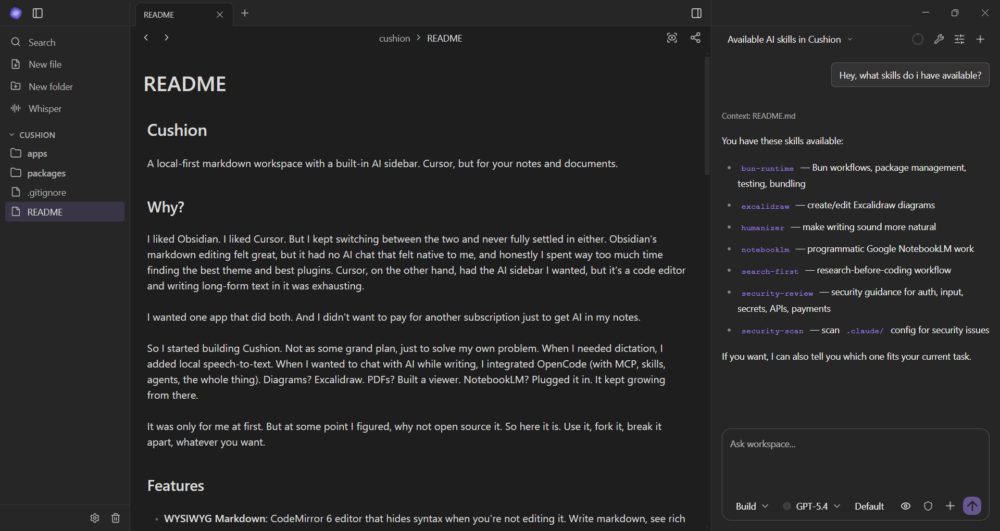

# Cushion

A local-first markdown workspace with a built-in AI sidebar. Cursor, but for your notes and documents.



## Why?

I liked Obsidian. I liked Cursor. But I kept switching between the two and never fully settled in either. Obsidian's markdown editing felt great, but it had no AI chat that felt native to me, and honestly I spent way too much time finding the best theme and best plugins. Cursor, on the other hand, had the AI sidebar I wanted, but it's a code editor and writing long-form text in it was exhausting.

I wanted one app that did both. And I didn't want to pay for another subscription just to get AI in my notes.

So I started building Cushion. Not as some grand plan, just to solve my own problem. When I needed dictation, I added local speech-to-text. When I wanted to chat with AI while writing, I integrated OpenCode (with MCP, skills, agents, the whole thing). Diagrams? Excalidraw. PDFs? Built a viewer. NotebookLM? Plugged it in. It kept growing from there.

It was only for me at first. But at some point I figured, why not open source it. So here it is. Use it, fork it, break it apart, whatever you want.

## Features

- **WYSIWYG Markdown**: CodeMirror 6 editor that hides syntax when you're not editing it. Write markdown, see rich text.
- **AI Chat Sidebar**: Powered by [OpenCode](https://opencode.ai). Skills, MCP servers, agents, multiple models (autodiscovered by OpenCode). No extra subscriptions.
- **Local Dictation**: Speech-to-text via Sherpa ONNX. Runs entirely on your machine, no cloud API needed.
- **Rich file support**: Excalidraw drawings, PDF viewer, KaTeX math, and more coming (CSV, calendar, ...).

## Getting Started

### Prerequisites

- [Bun](https://bun.sh) (v1.0+)
- [Node.js](https://nodejs.org) (v18+, required for Electron)

### Install

```bash
git clone https://github.com/Aleexc12/cushion.git
cd cushion
bun install
```

### Run

```bash
bun run dev:electron
```

### Build

```bash
# Package Electron app
bun run package:electron
```

## Status

Beta. I use it every day and it works, but there are rough edges. Contributions and feedback welcome.

## Acknowledgments

Cushion wouldn't exist without these projects:

- [Obsidian](https://obsidian.md) and [Zettlr](https://www.zettlr.com) for showing what a markdown workspace can be
- [OpenCode](https://opencode.ai) for the AI backend that powers the chat sidebar
- [Handy](https://handy.computer/) for the inspiration behind local AI dictation
- [codemirror-markdown-tables](https://github.com/ckant/codemirror-markdown-tables) for saving me from markdown table hell
- [notebooklm-py](https://github.com/teng-lin/notebooklm-py) for making the NotebookLM integration possible

## License

MIT
